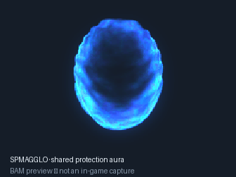
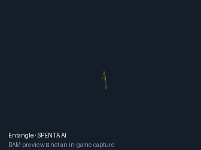
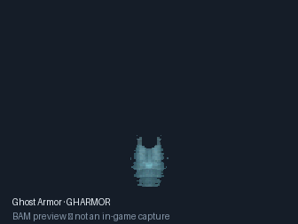
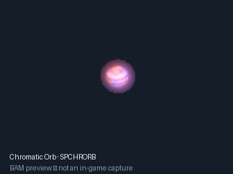
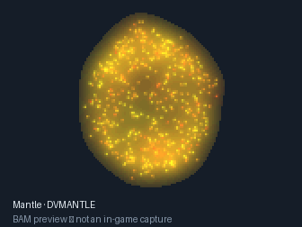
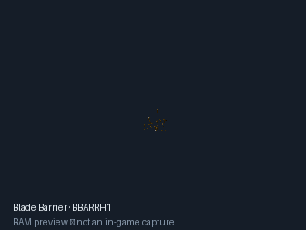
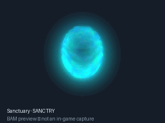
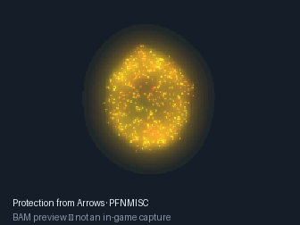
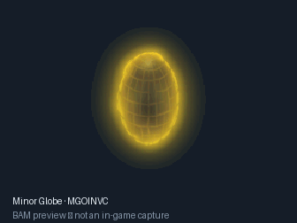
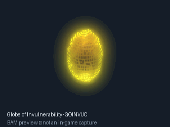

# Arcane Visions — Spell Effect Animations

**Standalone post-cast spell animations for EET and Baldur's Gate II: Enhanced Edition.**

Arcane Visions gives selected original BG spells the visual effects used by
Spell Revisions or Icewind Dale: Enhanced Edition. It replaces the artwork
shown after a spell is cast, while retaining the installed spell's mechanics.
**Spell Revisions and IWDification are not required.**

Current version: **v0.2.0-beta.3**, by **Sauler89**.
[Italian instructions](README.it.md) · [Affected spells](#affected-spells) ·
[Audit and validation](sr_original_spell_animations/docs/RIGOROUS_AUDIT.md)

## Animation examples

These GIFs are decoded from BAMs actually shipped with this mod. They are
illustrative previews, not screenshots captured in the game. Blend rendering
is approximated on a dark background; the engine controls placement, palette,
orientation and timing. Entangle shows an individual animated tendril.

| Shared protection aura — `SPMAGGLO` | Entangle — `SPENTAAI` | Ghost Armor — `GHARMOR` |
|:---:|:---:|:---:|
|  |  |  |

| Chromatic Orb — `SPCHRORB` | Mantle — `DVMANTLE` | Blade Barrier — `BBARRH1` |
|:---:|:---:|:---:|
|  |  |  |

| Sanctuary — `SANCTRY` | Protection from Arrows — `PFNMISC` |
|:---:|:---:|
|  |  |

| Minor Globe of Invulnerability — `MGOINVC` | Globe of Invulnerability — `GOINVUC` |
|:---:|:---:|
|  |  |

The two globe previews are **IWDEE effect animations**, added in beta.3.
The similarly named SR files `spwi406a/b/c` and `spwi602a/b/c` remain excluded
because they are icons. `SPMAGGLO` is a separate shared protection overlay.

## Components

| Component | Content | Assets |
|---|---|---|
| **0** | SR effect animations for selected original spells | 14 BAMs, 12 VVCs |
| **10** | Distinct IWDEE effects for 20 other original spells | 19 BAMs, 19 VVCs |

Components can be installed independently or together. Their targeted spell
lists are disjoint. The complete package contains **33 animation BAMs and
31 visual-controller VVCs**, and patches **36 original SPL files** in the
supplied EET baseline. Additional spells use the replaced native graphics.

No spellbook/action-bar/portrait icons, new spells, revised spell descriptions,
IWDEE or SR gameplay, source SPL/EFF/PRO files, creature avatars or weapons
are imported. Existing casting-feature effects, sounds, damage, saves,
protections, summon mechanics, spell levels and projectile indexes are retained.

## Installation

1. Extract the entire package into the EET/BG2EE game folder containing `chitin.key`.
2. Run `setup-sr_original_spell_animations.exe` and select English or Italiano.
3. Install component **0**, **10**, or both. No source-game exports are needed.

Install after **EET_end** and after other mods that change these spells.
Windows WeiDU 251 is bundled. On Linux/macOS, use a native WeiDU executable:

```sh
weidu sr_original_spell_animations/setup-sr_original_spell_animations.tp2
```

Uninstall or reinstall through the same installer. The existing installer,
folder names and component numbers are retained for compatibility with the
previous beta. EET/BG2EE are supported; BGEE alone, IWDEE and classic BG2 are
rejected before any assets are copied.

## Affected spells

### Component 0 — Spell Revisions artwork

| Original spell / effect | SPL | SR animation BAM |
|---|---|---|
| Entangle | `SPPR105` | `spentaai, spentaci` |
| Chromatic Orb | `SPWI118` | `spchrorb` |
| Invisibility | `SPWI206` | `illush` |
| Mirror Image | `SPWI212` | `illush` |
| Invisibility 10′ Radius | `SPWI307` | `illush` |
| Pixie Dust | `SPPR516` | `illush` |
| Ghost Armor | `SPWI317` | `gharmor` |
| Spirit Armor | `SPWI414` | `sparmor` |
| Shadow Door | `SPWI505` | `dvsdoor` |
| Implosion | `SPPR728` | `dvimplo` |
| False Dawn | `SPPR609` | `dvsun` |
| Conjure Lesser Fire Elemental | `SPWI516` | `dvelfire` |
| Conjure Lesser Air Elemental | `SPWI520` | `dvelair` |
| Conjure Lesser Earth Elemental | `SPWI521` | `dveleart` |
| Conjure Fire Elemental | `SPWI620` | `dvelfire` |
| Conjure Air Elemental | `SPWI621` | `dvelair` |
| Conjure Earth Elemental | `SPWI622` | `dveleart` |
| Mantle (SR: Prismatic Mantle) | `SPWI708` | `dvmantle` |
| Shared deflection / immunity / shield overlay | `SPWI318, SPWI618, SPWI519, SPWI510 and its school subspells; SPPR701` | `spmagglo` |


For elemental spells, only the arrival animation at the chosen point changes.
Counts, creatures, summon EFFs and spawn timing are retained. Mantle uses SR's
Prismatic Mantle artwork without its new gameplay. False Dawn uses two visual
phases without importing SR's damage, blindness, confusion or subspells.

**Shared-resource scope:** `SPMAGGLO` is a native engine overlay. Replacing it
also changes spells/items from other mods that use that same resource, when
their current effects enable the overlay. This is not limited to the listed
five protection spells. Entangle and Chromatic Orb also retain their native
resource names; other consumers of those BAMs receive the replacement art.

### Component 10 — IWDEE artwork

| Original BG spell | SPL | IWDEE animation BAM |
|---|---|---|
| Remove Paralysis | `SPPR308` | `RPARALH` |
| Poison | `SPPR411` | `POISONH` |
| Lesser Restoration | `SPPR417` | `LRESTORH` |
| Cure Critical Wounds | `SPPR502` | `CCWOUNH` |
| Blade Barrier | `SPPR603` | `BBARRH1`, `BBARRH2` |
| Finger of Death | `SPPR708` | `FODEATH` |
| Regeneration | `SPPR711` | `REGENERH` |
| Greater Restoration | `SPPR713` | `GRESTORH` |
| Storm of Vengeance | `SPPR722` | `FODEATH` |
| Death Spell | `SPWI605` | `DSPELLH` |
| Power Word Silence | `SPWI612` | `PWSILEH` |
| Sphere of Chaos | `SPWI711` | `CONFUSH` |
| Finger of Death | `SPWI713` | `FODEATH` |
| Power Word Stun | `SPWI715` | `PWSTUNH` |
| Abi-Dalzim's Horrid Wilting | `SPWI812` | `ADHWILH` |
| Dragon's Breath | `SPWI922` | `SPDRGNBR` |
| Sanctuary | `SPPR109` | `SANCTRY` |
| Protection from Normal Missiles / Arrows | `SPWI311` | `PFNMISC` |
| Minor Globe of Invulnerability | `SPWI406` | `MGOINVC` |
| Globe of Invulnerability | `SPWI602` | `GOINVUC` |


Storm of Vengeance replaces its existing direct visual cue only; its weather,
area and projectiles remain installed as before. Sphere of Chaos replaces its
direct hit cue, not the persistent Confusion/Chaos status indicator. Blade
Barrier preserves the existing duration of both visual layers. Dito/Finger of
Death variants and Storm of Vengeance share one isolated `FODEATH` copy.

The four persistent overlays retain their existing state opcodes, duration,
conditions and protections. Only the recognized graphic reference/mode changes.
Both globes use private resources, so minor and major can show different art
without replacing `MINORGLB` globally. Sanctuary's state is retained; it is
never replaced with a graphics-only effect.

## Compatibility and graphics handling

The installer edits the resources currently present in the game. Missing
spells or unsupported/truncated/shared effect layouts are skipped. Component
10 additionally requires the recognized original visual reference, target,
attachment and effect count in each ability; unfamiliar visuals from another
mod are skipped and logged. Component 0 deliberately replaces all 141/215
ability visuals of its selected spells, while retaining their nonvisual effects.

Private resource names are checked before installation. A collision aborts
that component before it can overwrite another mod's similarly named resource.
Native replacements intentionally overwrite the engine graphic resources.

Non-looping cues play their full sequence. Mantle follows the duration and
conditions of the existing weapon protection; False Dawn retains its two-phase
schedule. Elemental arrival cues are independent point effects, not changes to
opcode 67's resource fields. The IWD component preserves effect order/counts,
all nonvisual bytes and the probability/save/resistance/target conditions of
the replaced visual effects.

IWD selection was compared against **246 IWDEE BAMs, 386 exported EET BAMs,
and the 14 SR BAMs**. The supplied EET already contains IWDification, SCS and
other spell packs. Identical files, identical decompressed/rendered content,
shared cycles and recolored shared shapes were excluded. The final 19 IWD BAMs
have no complete/cropped-art/shape/emitted-RGB cycle match in those comparison
sets. This establishes distinctness against the supplied baseline, not every
BAM in every possible game installation or modlist.

**This is a selected import, not all IWDEE BAMs.** The beta.3 review found that
Sanctuary, Protection from Arrows and both globes had been omitted because the
original patcher handled direct 141/215 cues, not persistent engine overlays.
Their omission was **not** due to SR overlap. Other distinct candidates still
require integration of their projectile, area, status or subspell routes.
Call Lightning is pending missing IWDEE/EET `SKYBOLT.BAM` exports; its vertical
bolt was not in the supplied BAM set. See the
[selection and exclusion review](sr_original_spell_animations/docs/IWD_SELECTION_RECHECK.it.md)
and [all 246 BAM classifications](sr_original_spell_animations/docs/iwd_selection_recheck.csv).

## Validation and beta status

WeiDU installation, reinstallation and byte-exact uninstallation passed in
isolated fixtures, including the **36 real exported EET spells**. Assets were
checked for hashes, frame bounds/RLE data, cycle references, VVC dependencies,
phase indexes, private names and absence of external palettes/alpha BAMs/audio.

An additional **22 regression cases** cover malformed layouts, an unused global
index, conditional visual effects, wrong targets/delays, resource collisions
and unsupported games. Source SR spell layouts and both EET/BG2EE synthetic
profiles also passed. **44 further overlay cases** verify state and conditional
duration preservation, recognized/custom layouts, safe skips and collisions.
Full details and retained results are in
[the rigorous audit](sr_original_spell_animations/docs/RIGOROUS_AUDIT.md).

**The mod has not yet been visually tested in a launched EET game.** Position,
blending and synchronization of the effects require in-game confirmation.
The GIFs do not replace that test. Install/uninstall tests use minimal KEY/TLK
fixtures and exported resources; they do not load a complete game installation.

## Development

```sh
python3 tests/verify_assets.py [path/to/extracted/spell_rev]
python3 tests/verify_graphics_integrity.py [path/to/IWDEE-BAM-export]
python3 tests/verify_installer.py /path/to/weidu [path/to/extracted/spell_rev]
python3 tests/verify_regressions.py /path/to/weidu
python3 tests/verify_iwd_on_export.py /path/to/EET-export /path/to/weidu /path/to/results
python3 tests/verify_overlays.py /path/to/EET-export /path/to/weidu /path/to/results
```

Tests require Python 3 and WeiDU. Preview generation additionally needs Pillow:
`python3 tools/render_bam_previews.py`. The IWD builder requires owner-supplied
IWDEE metadata/BAM exports; it is unnecessary for installation. Source and
installed hashes are retained in the asset manifests.

## Credits and asset terms

Spell Revisions: **Demivrgvs (Marco Montagnoli)**, with **Mike1072** and
**Ardanis**. Its supplied README credits **Yarpen** and **Scorpio** for BAM work.
Original SR copyright: **2008–2015 Marco Montagnoli**. IWDEE graphics are
credited to **Black Isle Studios/Interplay and Beamdog**; BG graphics to their
respective original creators. This project claims no ownership of those assets.

The supplied SR README says: “This mod may not be sold, published, compiled
or redistributed in any form without the consent of its author.” That source
notice remains applicable; inclusion here does not grant a new graphics license.
WeiDU is distributed under its own license in [WeiDU license](sr_original_spell_animations/docs/WEIDU-COPYING.txt).
See [CREDITS.md](CREDITS.md) for provenance and technical references.
